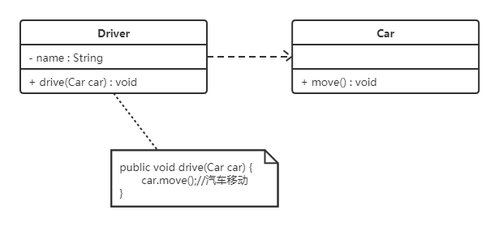

##   设计模式分类

* 创建型模式
  用于描述“怎样创建对象”，它的主要特点是“将对象的创建与使用分离”(解耦)。GoF（四人组）书中提供了单例、原型、工厂方法、抽象工厂、建造者等 5 种创建型模式。
* 结构型模式
  用于描述如何将类或对象按某种布局组成更大的结构，GoF（四人组）书中提供了代理、适配器、
  桥接、装饰、外观、享元、组合等 7 种结构型模式。
* 行为型模式
  用于描述类或对象之间怎样**相互协作共同完成单个对象无法单独完成的任务**，以及怎样分配职责。
  GoF（四人组）书中提供了模板方法、策略、命令、职责链、状态、观察者、中介者、迭代器、访
  问者、备忘录、解释器等 11 种行为型模式。  

## 类与类之间关系

### 关联关系

关联又可以分为单向关联，双向关联，自关联。

#### 单向关联

在UML类图中单向关联用一个带箭头的实线表示。上图表示每个顾客都有一个地址，这通过让
Customer类持有一个类型为Address的成员变量类实现 。

#### 双向关联  

从上图中我们很容易看出，所谓的双向关联就是双方各自持有对方类型的成员变量。
在UML类图中，双向关联用一个不带箭头的直线表示。上图中在Customer类中维护一个
List<<Product>>，表示一个顾客可以购买多个商品；在Product类中维护一个Customer类型的成员
变量表示这个产品被哪个顾客所购买。  

#### 自关联

自关联在UML类图中用一个带有箭头且指向自身的线表示。上图的意思就是Node类包含类型为Node的成员变量，也就是“自己包含自己”。  

### 聚合关系

聚合关系是关联关系的一种，是强关联关系，是整体和部分之间的关系。
聚合关系也是通过成员对象来实现的，其中成员对象是整体对象的一部分，但是成员对象可以脱离整体
对象而独立存在。例如，学校与老师的关系，学校包含老师，但如果学校停办了，老师依然存在(**可以独立存在**)。
在 UML 类图中，聚合关系可以用带空心菱形的实线来表示，菱形指向整体。下图所示是大学和教师的
关系图：  

### 组合关系

组合表示类之间的整体与部分的关系，但它是一种更强烈的聚合关系。
在组合关系中，整体对象可以控制部分对象的生命周期，一旦整体对象不存在，部分对象也将不存在，
部分对象不能脱离整体对象而存在。例如，头和嘴的关系，没有了头，嘴也就不存在了(**不可以独立存在**)。
在 UML 类图中，组合关系用带实心菱形的实线来表示，菱形指向整体。下图所示是头和嘴的关系图：  

### 依赖关系  

依赖关系是一种使用关系，它是对象之间耦合度最弱的一种关联方式，是临时性的关联。在代码中，某
个类的方法通过局部变量、**方法的参数或者对静态方法的调用来访问另一个类**（被依赖类）中的某些方
法来完成一些职责。
在 UML 类图中，依赖关系使用带箭头的虚线来表示，箭头从使用类指向被依赖的类。下图所示是司机
和汽车的关系图，司机驾驶汽车：  

### 继承关系

继承关系是对象之间耦合度最大的一种关系，表示一般与特殊的关系，是父类与子类之间的关系，是一
种继承关系。
在 UML 类图中，泛化关系用带空心三角箭头的实线来表示，箭头从子类指向父类。在代码实现时，使
用面向对象的继承机制来实现泛化关系。例如，Student 类和 Teacher 类都是 Person 类的子
类，其类图如下图所示：  

### 实现关系

实现关系是接口与实现类之间的关系。在这种关系中，类实现了接口，类中的操作实现了接口中所声明
的所有的抽象操作。
在 UML 类图中，实现关系使用带空心三角箭头的虚线来表示，箭头从实现类指向接口。例如，汽车和
船实现了交通工具，其类图如图 所示。  

## 软件设计原则

### 开闭原则  

### 里氏代换原则  

### 依赖倒转原则  

### 接口隔离原则  

### 迪米特法则  

### 合成复用原则  
